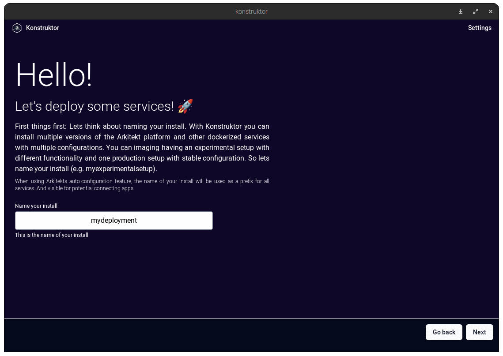

# Konstruktor

This is the repository for the Konstruktor project, which primarily serves as an entrypoint and installer for
the [Arkitekt](http://arkitekt.live) platform.

# About Docker!

Konstruktor is only a user-friendly wrapper around the Docker and Docker Compose tools. As such, it requires that
Docker is installed on the host machine. The installer will check for the presence of Docker and Docker Compose, but
will **not** install them.

 Please refer to the [Docker documentation](https://docs.docker.com/get-docker/) for
instructions on how to install Docker on your machine.

## Installation

Konstruktor is an executable app that can be installed with the installer found in the releases section of this
repository. The installer is available for Windows, Mac and Linux. The installation should be prettry straigthforward.

## Usage

Konstruktor is an admin tool, which allows for the creation of new Arkitekt Deplyoement, as well as their monitoring
and management. 

## Disclaimer

Konstruktor is a work in progress and is not yet ready for production use. It is provided as-is, without any warranty.
While we do our best to ensure that Konstruktor is usable for non-technical users, we cannot guarantee that it will
work on all systems. If you encounter any issues, please report them in the issues section of this repository. We would
really appreciate it if you could provide as much information as possible about your system and the issue you are
encountering.

## License

Konstruktor is licensed under the MIT license. Please refer to the LICENSE file for more information.

## Additional information

While *designed* for Arkitekt, Konstruktor can theoretically be used to deploy any Docker Compose project. We are working
on providing some documentation on how to accomplish this and how to use Konstruktor as a general purpose installer for
other docker based (bioimage) projects like OMERO or ElabFTW. If you are interested in this, please let us know by
opening an issue in this repository.
