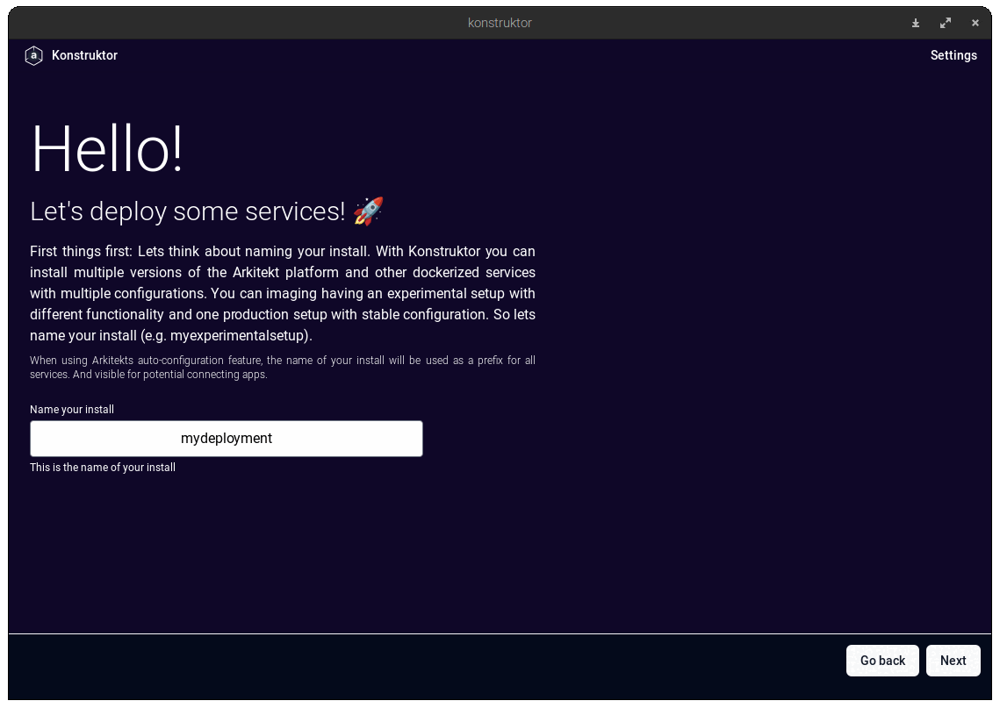

# Konstruktor

This is the repository for the Konstruktor project, which primarily serves as an entrypoint and installer for
the [Arkitekt](http://arkitekt.live) platform.




# About Docker!

Konstruktor writes the deployment itself and hands it to Docker Compose to run, so Docker has to be
installed on the host machine — but nothing else does. There is no Python, no `arkitekt-next` CLI and
no helper container involved. The app checks for the presence of Docker and Docker Compose, but will
**not** install them.

The check runs as the app starts and again as the first step of the wizard, and it answers three
questions separately, because each "no" has its own remedy: the `docker` binary is missing (install
Docker), the CLI is there without its compose plugin (install a current Docker), or the daemon is not
answering (start Docker). The wizard will not go past that step until all three are satisfied.

 Please refer to the [Docker documentation](https://docs.docker.com/get-docker/) for
instructions on how to install Docker on your machine.


## Installation

### The command line

```
curl -fsSL https://raw.githubusercontent.com/arkitektio/konstruktor/master/install.sh | sh
```

Detects your platform, downloads the matching binary, verifies it against the release's
published `SHA256SUMS`, installs it to `~/.local/bin`, and — when there is a terminal
attached — asks for a hub identifier and creates that hub in `~/MyHubs/<identifier>`.
Pass `--hub-dir <path>` to put it somewhere else, or `--no-run` to just install it.

`~/MyHubs` is only a default. A hub folder holds the database and the object store, so it
can live wherever you want it — `hub create` takes a directory, the way `git init` does,
and defaults to the one you are standing in. Wherever hubs land, konstruktor keeps its own
index of them, so `konstruktor list` finds them all and every command takes a name:

```
konstruktor hub create          # the wizard, here
konstruktor hub create /mnt/data/lab-hub
konstruktor list                # what this machine knows about
konstruktor status [target]     # what a hub is, and what is running
konstruktor up|stop|down|pull|ps|logs [target]
konstruktor doctor              # is Docker ready?
```

Every answer has a flag, so a hub can be created unattended:

```
konstruktor hub create ~/MyHubs/lab-hub --server go.arkitekt.live \
  --identifier lab-hub --services rekuest,mikro,fluss --yes
```

Addresses work the same way as in the wizard: `--reach local-only|this-network|public`
picks them by how far the hub should reach, defaulting to `this-network`, and `--host`
overrides that with exactly what to advertise.

With a terminal, missing answers are prompted for; without one they are an error naming
the flag that would have supplied it, so CI never hangs on a prompt. `[target]` is a path
or the name of a registered deployment — the CLI and the desktop app share one registry,
so a hub created in either shows up in the other.

The one interactive step is the authorization itself: the CLI prints the URL and the short
code, and waits while somebody with an account accepts the hub in a browser.

### The desktop app


Konstruktor is an executable app that can be installed with the installer found in the releases section of this
repository. The installer is available for Windows, Mac and Linux. The installation should be prettry straigthforward.

## Usage

Konstruktor creates and manages **hubs**: the data and compute services (rekuest, mikro, fluss, …)
that make up an Arkitekt deployment. A hub manages no accounts of its own — users, organizations and
permissions live on a *coordination server* such as [go.arkitekt.live](https://go.arkitekt.live), and
the hub is authorized against one before it exists on disk.

Creating a hub walks through a folder, the coordination server and the hub's name there, which
services to run, which ports to publish, how far the hub should reach, and whether it joins a mesh.
The last step is the authorization itself: Konstruktor sends the hub's manifest
to the coordination server, shows you a short code, and opens the page where somebody with an account
accepts the hub into an organization. Only once that comes back does anything get written.

The wizard opens on answers that already work — Docker is checked before the first question, the
folder defaults to `MyHub` in your home directory, the hub identifier is the folder's name slugified,
and `go.arkitekt.live` is offered as the coordination server alongside any you have used before.
Everything that has a working default sits under an "Advanced" disclosure on its step, so each step
asks the one question it is actually there for.

### Addresses

Clients ask the coordination server where a service lives and get back whatever this machine
claimed to be reachable at, so a wrong address is worse than a missing one. The Addresses step asks
the question people actually have — local only, this network, or public — and picks the addresses
that answer it. Everything found is shown either way, grouped by what it is: loopback, LAN, mesh,
public, and the names this machine resolves to, graded by whether they point back here. A name that
resolves to `127.0.1.1`, which is what most Linux boxes give their own hostname, is offered but
never assumed.

Addresses that exist and cannot help a peer — docker bridges, virtual interfaces, link-local — are
no longer hidden. They sit behind a disclosure with the reason attached, because "why is my address
not in the list" is easier to answer next to the address than in a source file.

Tailnet addresses get their own treatment, because a machine is often on more than one. An address
is only shown as this hub's **mesh** when it can be shown to belong to the tailnet the coordination
server runs; every other `100.64/10` address — the personal tailscale most laptops already have —
is listed under **other tailscales**. Those stay tickable, since a lab where every client is on that
tailnet is a real setup, but nothing picks them for you and they are never advertised as mesh
addresses, which would offer the organization an address none of its machines can route to.

Telling the two apart needs the coordination server to declare its tailnet in
`/.well-known/fakts` — konstruktor reads `mesh_domain` (or `tailnet_domain`, `ionscale_domain`,
`magic_dns_suffix`) and matches the MagicDNS suffix against what it finds. No server declares it
yet, so until one does every tailnet address is "other", which is also the truth during the wizard:
the hub has not joined anything at that point. Once a hub has joined, its own mesh hostname is
enough to recognise its node on the Authorize screen.

Each address is labelled with how far it actually reaches, and that label is what the coordination
server is told: `local`, `network`, `public`, or `ionscale` for the hub's own tailnet. Konstruktor can also say
which of these the internet sees this machine as, and — once the hub is running — ask an external
prober whether anything answers on it. Both need an endpoint configured in Settings, and neither is
on by default: every other request this app makes goes to the coordination server you named, and
these would not.

### The mesh

A hub advertised only at LAN addresses is only reachable from that LAN. The mesh step joins it to the
organization's tailnet: a `tailscale/tailscale` sidecar runs alongside the gateway, and the gateway is
published inside that container's network namespace, so the hub is on the tailnet under a name of its
own.

Joining and *being advertised* are two steps, not one. The manifest sent at authorization time carries
the addresses picked on the Addresses step, and the tailnet address does not exist until the hub has
actually joined — so once the stack is up, add that address on the dashboard and authorize again. Only
then do clients off this network get told where the hub lives.

The credential is a single-use pre-authorized key, and it can come from either end. "Join the
organization's mesh" sets `request_auth_key` on the hub manifest, so the coordination server mints one
while it is accepting the hub and returns it in the grant envelope — no second trip. Whoever approves
the hub decides whether to grant it, so an approval can come back without a key. Alternatively a key
from a tailnet you run yourself can be pasted, together with the control server it belongs to.

A hub without a mesh generates exactly what it generated before the mesh existed: no `mesh` block in
`hub_config.yaml`, no sidecar, no extra volume.

What lands in the folder is an ordinary Docker Compose project — `hub_config.yaml`,
`docker-compose.yaml`, a `configs/` directory and `hub_credentials.json` — which you can start, stop
and inspect from the app, or drive with `docker compose` yourself. Nothing about a deployment is
locked to Konstruktor.

A hub can be authorized again later from its dashboard, which is how you add services, move it to a
different network, or point it at another coordination server.

### How it works

Konstruktor generates the whole deployment in-process. The profile, the `docker-compose.yaml`,
the Caddyfile and every service's configuration file are produced by `konstruktor-core`, a Rust
port of [`arkitekt-next`](https://github.com/arkitektio/arkitekt-next)'s own generator, checked
against that generator's real output by golden-file tests
(`crates/konstruktor-core/tests/generate.rs`). The only thing Docker is asked to do is run the
result.

The core is the whole product; the desktop app and the `konstruktor` command are two front ends
over it. Creating a hub — build the profile, authorize it, write the folder, start the stack — is
one function in the core that takes a progress callback, so the two front ends run the same code
rather than merely equivalent code. The desktop app renders those progress events through a Tauri
channel; the CLI prints them.

```
crates/konstruktor-core/   generation · authorization · docker · the registry
crates/konstruktor-cli/    the `konstruktor` binary
src-tauri/                 Tauri commands, and nothing else
src/                       React
```

Authorization is the canonical fakts device-code flow: the hub manifest is POSTed to the coordination
server's `hub_authorization_endpoint` (discovered from `/.well-known/fakts`), a human accepts it in
the browser, and Konstruktor polls the OAuth2 token endpoint until the grant comes back carrying the
hub's identity — the JWKS URL the generated services verify inbound tokens against.

## Disclaimer

Konstruktor is a work in progress and is not yet ready for production use. It is provided as-is, without any warranty.
While we do our best to ensure that Konstruktor is usable for non-technical users, we cannot guarantee that it will
work on all systems. If you encounter any issues, please report them in the issues section of this repository. We would
really appreciate it if you could provide as much information as possible about your system and the issue you are
encountering.

## License

Konstruktor is licensed under the MIT license. Please refer to the LICENSE file for more information.


## Additional information

Konstruktor deploys Arkitekt through the `arkitekt-next` CLI, so the deployments it produces are exactly
those the CLI produces — bug reports about a generated stack belong upstream, while anything about the
wizards, the dashboard or the CLI invocation belongs here.

### Development

```bash
pnpm install
pnpm tauri dev        # run the app
pnpm test             # unit tests, no Docker needed
KONSTRUKTOR_E2E=1 pnpm test   # additionally runs the real CLI in Docker
```

### Releases

The version is not edited by hand — it is derived from the commit subjects on `master`. Every push
that contains a releasable commit bumps the version, tags it, and publishes a signed release; the
tag is the single source of truth that `install.sh` resolves through
`/releases/latest/download`.

| Commit subject | Effect |
| --- | --- |
| `fix:`, `perf:`, `revert:` | patch — `1.2.3` → `1.2.4` |
| `feat:` | minor — `1.2.3` → `1.3.0` |
| `feat!:` (any type with `!`), or a `BREAKING CHANGE:` footer | major — `1.2.3` → `2.0.0` |
| `chore:`, `docs:`, `ci:`, `refactor:`, `style:`, `test:` | no release |

That last row is how you push without shipping. A release is built as a draft and only becomes the
one `/releases/latest` resolves to once every artifact — including `SHA256SUMS`, which `install.sh`
requires — has been attached. But it is public, signed and notarized from that moment on, with no
review step in between, so the subject line you write is the release note your users read: `fix:
stuff` makes a changelog entry that says `fix: stuff`.

Versioning is handled by [cocogitto](https://docs.cocogitto.io/), configured in `cog.toml`. The
version is declared in exactly one place — `[workspace.package] version` in `Cargo.toml` — and
`cargo set-version` propagates it to the member crates and `Cargo.lock` during the bump.
`src-tauri/tauri.conf.json` and `package.json` carry no version of their own: Tauri falls back to
`src-tauri/Cargo.toml`, which inherits the workspace version.

To see what the next release would be, without changing anything:

```bash
cog bump --auto --dry-run   # commit or stash first: cog refuses to run on a dirty tree
```

To release a version the commit log cannot describe on its own, run the "Publish Everything"
workflow manually and give it an explicit version.
