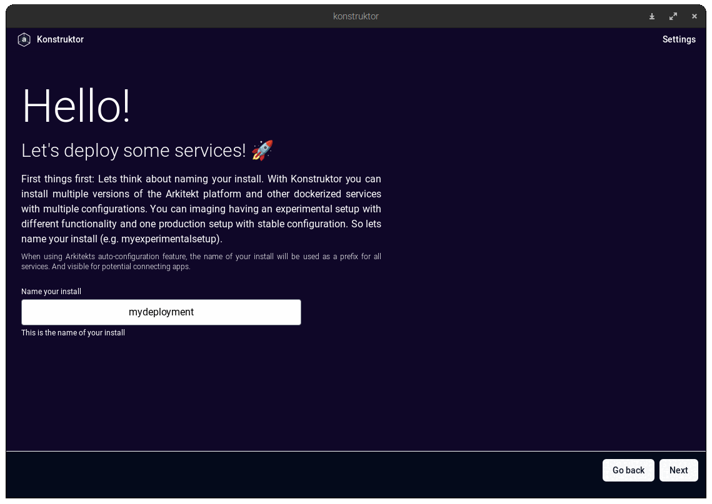
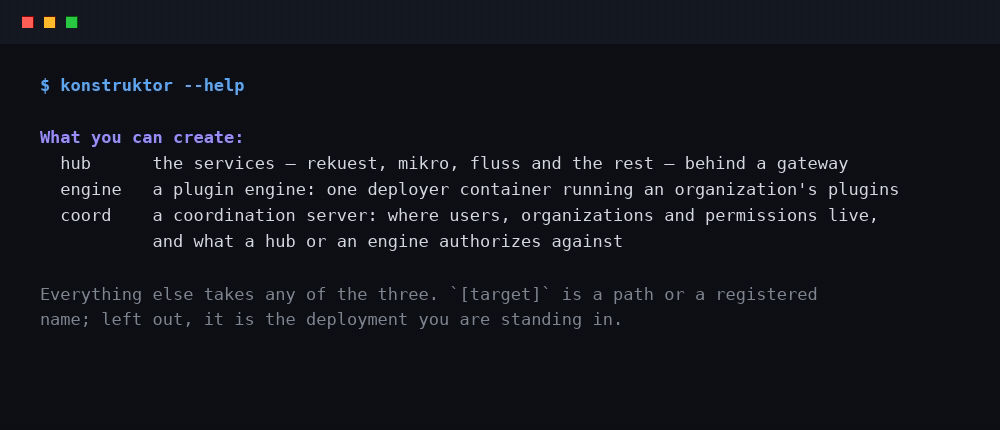

# Konstruktor

This is the repository for the Konstruktor project, which primarily serves as an entrypoint and installer for
the [Arkitekt](http://arkitekt.live) platform.

Konstruktor is one product with two front ends: a desktop app and a `konstruktor` command
line. Both link the same core, so neither can drift from the other.



<sub>The desktop screenshots above are from an older build; the wizard has since been
rebuilt. The terminal below is current.</sub>




# About Docker!

Konstruktor writes the deployment itself and hands it to Docker Compose to run, so a
Docker-compatible container engine has to be on the machine, in any form.

If you don't have one, the wizard can install one for you. The recommended engines are:

| OS      | Recommended                                  | Also works                                    |
| ------- | -------------------------------------------- | --------------------------------------------- |
| macOS   | **Colima** — one click if Homebrew is there  | OrbStack, Podman Desktop, Docker Desktop      |
| Windows | **Rancher Desktop** — one click via `winget` | Podman Desktop, Docker Desktop                |
| Linux   | **Docker Engine** from your distribution     | Podman (`podman-docker` + `podman-compose`)   |

On macOS and Windows the app can run the installer for you and shows its output as it goes. On
Linux it gives you the commands to paste — they need `sudo`.


## Installation

### The command line

```
curl -fsSL https://raw.githubusercontent.com/arkitektio/konstruktor/main/install.sh | sh
```

Detects your platform, downloads the matching binary, verifies it against the release's
published `SHA256SUMS` and installs it to `~/.local/bin`. Then, when there is a terminal
attached, it asks two things, both defaulting to yes: whether to put that folder on your
`PATH`, and whether to create a hub now — which asks for an identifier and creates the hub
in `~/MyHubs/<identifier>`. Pass `--hub-dir <path>` to put it somewhere else,
`--template personal` to make a personal hub instead of a lab hub (see
[templates](#templates)), or `--no-run` to install and ask nothing.

The `PATH` part is `konstruktor self install`, and can be run on its own at any time. It
writes one marked block into the startup file of every shell the machine is set up for —
`.zshrc`, `.bashrc`, `.bash_profile`, `.profile`, fish's `conf.d` — creating one only for
your login shell, and running it again changes nothing.

On Windows, in PowerShell:

```
irm https://raw.githubusercontent.com/arkitektio/konstruktor/main/install.ps1 | iex
```

The same steps: it verifies the binary against `SHA256SUMS`, installs it to
`%LOCALAPPDATA%\Programs\konstruktor`, then asks whether to add that to your user `PATH` and
whether to create a hub now in `~\MyHubs\<identifier>`. Piped, it reads its options from the environment
(`KONSTRUKTOR_NO_RUN=1`, `KONSTRUKTOR_HUB_DIR`, `KONSTRUKTOR_TEMPLATE`, `KONSTRUKTOR_VERSION`,
`KONSTRUKTOR_INSTALL_DIR`); run as a script it takes `-NoRun`, `-HubDir`, `-Template`,
`-Version` and `-Dir`.

Both installers take the newest *published* release. A release stays a draft until every
binary and `SHA256SUMS` are attached, so a release whose build failed is never installed.

A machine that has Konstruktor gets the next one with **`konstruktor self update`**: the
same release the installers would take, checked against the same `SHA256SUMS`, put where
the running binary is. `--check` only says whether there is one, `--version 0.19.0` takes
that release instead — an earlier one too. `konstruktor update` says when a newer
Konstruktor is published, since a service's release may need it. A Konstruktor that came
from PyPI is upgraded with the tool that installed it (`uv tool upgrade konstruktor`), and
is told so.

`~/MyHubs` is only a default. A hub folder holds the database and the object store, so it
can live wherever you want it — `hub create` takes a directory, the way `git init` does,
and defaults to the one you are standing in. Wherever hubs land, konstruktor keeps its own
index of them, so `konstruktor list` finds them all and every command takes a name:

Konstruktor deploys three things. Which one you have decides how you *create* it; once it
exists it is a deployment like any other, and starting, stopping, inspecting and removing it
work the same for all three:

| | what it is |
|---|---|
| `hub` | the services — rekuest, mikro, fluss and the rest — behind a gateway |
| `engine` | a plugin engine: one deployer container running an organization's plugins |
| `coord` | a coordination server: where users, organizations and permissions live, and what a hub or an engine authorizes against |

```
# create a deployment
konstruktor hub create          # asks you what you want, here
konstruktor hub create /mnt/data/lab-hub
konstruktor hub create --template personal   # a ready-made kind of hub
konstruktor hub templates       # the kinds there are
konstruktor engine create ~/plugins
konstruktor coord create ~/lab-coord

# run it — any of the three
konstruktor up|stop|down|pull|ps|logs [target]
konstruktor logs -f [target]    # stay attached; Ctrl-C stops it
konstruktor restart [service]   # bounce a container that has wedged
konstruktor status [target]     # what a deployment is, and what is running
konstruktor list                # what this machine knows about

# change a hub
konstruktor hub services add|remove <ids…>  # change a hub's services
konstruktor authorize [target]  # authorize again: new addresses, or a mesh key
konstruktor update [target]     # only what has actually moved upstream
konstruktor rollback [target]   # back onto the images it ran before that
konstruktor freeze [target]     # have update leave it alone; --service for some
konstruktor unfreeze [target]   # let update move it again
konstruktor open [target]       # the hub in a browser
konstruktor check [target]      # does every service answer on every address?
konstruktor compose show|validate|edit|reset|undo [target]
konstruktor hub regenerate [target]  # rewrite its generated files from its profile
konstruktor superuser <service> # an admin account in one service
konstruktor checkout [branch]   # a dev hub's source checkouts

# change an engine
konstruktor engine attach [target] --hub <hub>   # join a hub's network
konstruktor engine detach [target]

# back up a hub
konstruktor backup <folder>
konstruktor restore <backup>

# troubleshoot
konstruktor doctor [--fix]      # is Docker ready — and make it so
konstruktor report <service>    # a bug report, with the log's secrets removed

# remove — least to most
konstruktor forget|purge|destroy [target]

# konstruktor itself
konstruktor self install        # put it on your PATH
konstruktor self update         # replace it with the newest release of itself
```

`[target]` is a path or a name from `konstruktor list`; left out, it is the deployment you
are standing in. Every command that takes one also takes it as `--in <target>`, which is the only spelling
where the positional is something else — a service, a branch, a backup folder:
`konstruktor restart mikro --in lab-hub`. `konstruktor --help` lists the commands under
these same headings.

> **`coord create` is not finished.** A coordination server is a first-class deployment —
> it is recognised on disk, listed, and driven by every lifecycle command above — and
> Konstruktor can generate a hub that *runs* one (see [a self-contained hub](#a-self-contained-hub)).
> A coordination server on its own, which other hubs authorize against, also needs the
> account frontend where somebody accepts them, and that is not generated yet. `coord create`
> says so and writes nothing. Until it lands, point hubs at a coordination server you
> already run with `hub create --server <address>`.

`pull` fetches every image whether anything changed or not; **`update`** asks each registry
whether the tag has moved and recreates only those services. `--check` reports without
touching anything.

Updating is the operation that can lose data, so `update` does four things before it
touches a container. It **backs the hub up first** (`--no-backup` opts out), because an
update migrates each service's database forward before it starts the new build, and no image
can be moved back far enough to undo that. It **holds the infrastructure back** — the database, the cache,
the gateway, the object store — unless asked with `--infra`, since those are where a moved
image means a store the new binary will not open. It **refuses to move Postgres across a
major**, comparing what the pulled image declares against what wrote the data on disk, so
the alternative is a crash loop rather than a question — and `konstruktor up` refuses the
same thing, because a `compose up` applies whatever the tag resolves to by then. And it **checks the services still
answer** afterwards, so a failed migration is a failed update rather than a red dot
somebody notices next week.

It also writes `hub_lock.json` beside the profile: what every service was running, and the
digest it resolved to, before and after. **`rollback`** reads that and puts the images
back. It says at the prompt what it cannot do — a migration is one-way, so the older code
comes back to the newer schema, and the backup taken before the update is the rest of the
answer.

New hubs pin their infrastructure to something immutable. `caddy` and `redis` get exact
version tags; `jhnnsrs/daten` (Postgres) and `jhnnsrs/init` publish only channel tags, so
they are pinned by digest with the channel kept beside it. Hubs created before this keep
the tags they have — which is why the guard above exists as well as the pin.

The services follow a channel — a major, `jhnnsrs/rekuest:6` — and still run **exact
builds**. The profile names the channel; `hub_lock.json` holds the digest that channel
resolved to; and the compose file is written from both, as `repo:tag@sha256:…`. So
starting, restarting, restoring or copying a hub runs the builds it ran, whatever the tags
point at by then, and **`update` is the one thing that looks at a channel again**. A new
major of a service arrives with the Konstruktor that writes files for it.

**`freeze`** tells `update` to leave a hub alone — all of it, or `--service` by service —
and **`unfreeze`** lifts that. Neither changes a file or restarts anything: the builds are
written down either way, and a freeze only says not to look for newer ones.

Konstruktor knows nothing of what is inside a service's image, and asks. Run with no
command, a service's image says what it is and stops (the
[arkitekt-service](https://github.com/arkitektio/arkitekt-service) package does that for the
Python services): what it is registered as, what it needs from a hub, how it is started —
for production and for `--debug` — what prepares its database, what writes its config, and
what else can be run in it. Every command Konstruktor runs in an image afterwards is one
that answer named. That is why creating a hub asks every image first, before a file is
written: the compose file is written from the answers, and an image that does not answer is
refused with nothing on disk. (`--dry-run` asks nobody, and fetches nothing.)

`konstruktor inspect <service>` shows what a hub's service said, and `konstruktor inspect
--image jhnnsrs/mikro:7` asks any image, without a hub — which is how to find out whether
an image is one a hub could run. `--json` prints the description whole.

What an image offers beside its start are its **jobs**. `konstruktor job list` shows them for
every service, `konstruktor job run <service> <job>` runs one in a container of its own, and
what follows `--` is passed on to it:

```
konstruktor job list lok
konstruktor job run lok ensureusers
konstruktor job run rekuest plan          # the migrations the next start would apply
```

A service's config is not Konstruktor's to write either. Given the hub's facts, the image
writes its own config for the release it is. Konstruktor
writes `facts/<service>.yaml` (database, storage, keys, the other services and what they
offer) and the image turns that into `configs/<service>.yaml`. What you set yourself goes in
`overrides/<service>.yaml` (`konstruktor config set`) and is laid over it; a setting a
release does not read is refused by name. And a service's start only serves: its database
is prepared — migrated, and set up — by the job its image names for that, once per build,
before it is started.

Some moves need more than new files. A change to the hub itself — a volume, a one-off
container — is a command written beside the layout it belongs to, run by the update that
crosses it: before anything is replaced where it can be, so that a failure leaves the hub
running as it was. A change to a service's own data is that service's: when its build
changes, `update` stops it, runs the new release's `migrate` job — its migrations, then its
setup — and starts it. Nothing is keyed to a version: there is no separate upgrade step. What
a service's migrations and jobs are held to so that this works is written with the contract:
[arkitekt-service/docs/migrations-and-jobs.md](https://github.com/arkitektio/arkitekt-service/blob/main/docs/migrations-and-jobs.md).

A pin never moves on its own; that is the point of it. So **`update --infra` also advances
pins**: it asks each infrastructure image's registry what versions it publishes, offers the
newest of the *same major and the same variant*, and on approval rewrites the profile,
regenerates and recreates. Crossing a major is never offered — that is a migration, and the
guard exists to make it a decision. `rollback` puts the previous version back.

The three ways to remove a deployment are separate commands because they are three
different amounts of destruction: **`forget`** stops listing it and touches no files,
**`purge`** deletes its data and keeps the hub, and **`destroy`** removes the containers,
what Konstruktor wrote into the folder and the registry entry. Nothing else in the folder
is touched: a hub made in a home directory is deleted without the home, and any other
folder goes with it only if the hub was all it held. Each prints what it is about to take — including source
checkouts that may hold commits pushed nowhere — before it asks.

An authorized hub is also listed on its coordination server, and **`destroy` removes it
there first**, logged in as the hub itself. If the server cannot be asked — it is down, it
refuses the hub's login, or it predates the endpoint — nothing is deleted, because the
login that could ask later goes with the volumes. `destroy --local-only` deletes what is on
the machine anyway and leaves the hub listed, for an administrator of that server to remove.

Every answer has a flag, so a hub can be created unattended:

```
konstruktor hub create ~/MyHubs/lab-hub --server go.arkitekt.live \
  --identifier lab-hub --services rekuest,mikro,fluss --yes
```

#### Templates

A template is a ready-made kind of hub, so you do not have to pick the services yourself:

| template | what you get |
|---|---|
| `default` | A lab hub: images, workflows, apps, a knowledge graph and language models |
| `personal` | A hub for yourself: bank accounts, mail, documents and your location timeline |

```
konstruktor hub templates                        # show them
konstruktor hub create ~/MyHubs/home --template personal
```

If you do not name a template, `hub create` asks you a few questions instead and you pick
the services yourself. A template is only a starting point: you can add or remove services
later with `konstruktor hub services add|remove`.

`--dry-run` prints the files it would write and stops, so an unattended invocation can be
rehearsed before it is trusted. `--json` on `status`, `list`, `ps`, `wait`, `doctor`,
`update --check`, `rollback`, `hub templates` and `hub create` puts a document on stdout and nothing else — the narration is on stderr,
so `konstruktor status --json | jq .` works in a pipe.

Addresses work the same way as in the wizard: `--reach local-only|this-network|public`
picks them by how far the hub should reach, defaulting to `this-network`, and `--host`
overrides that with exactly what to advertise.

With a terminal, missing answers are prompted for; without one they are an error naming
the flag that would have supplied it, so CI never hangs on a prompt. `[target]` is a path
or the name of a registered deployment — the CLI and the desktop app share one registry,
so a hub created in either shows up in the other.

The one interactive step is the authorization itself: the CLI prints the URL and the short
code, and waits while somebody with an account accepts the hub in a browser.

### A self-contained hub

`--server local` runs the coordination server *in* the hub's stack, the way `--rekuest local`
runs Rekuest there. Nobody has to accept it and nothing leaves the machine, so it is the
one kind of hub that can be created entirely unattended — which is what a test suite, a CI
job or a demo on a laptop needs:

```
konstruktor hub create ./hub --server local --services rekuest,mikro \
  --http-port 7190 --redeem-tokens 3 --yes --json
konstruktor wait ./hub          # until everything a client opens answers
```

Konstruktor is the root of trust here. It mints the key the coordination server signs
with and writes the public half into every service's config, and it writes the hub's own
manifest into the coordination server's config as something registered on boot. What the
stack starts out with is yours to say:

| flag | |
|---|---|
| `--org`, `--user`, `--user-password` | the organization, and the account in it that apps act as (`demo` / `demo`, password generated) |
| `--redeem-tokens N` | how many redeem tokens to mint (1) |
| `--redeem-token TOKEN` | one to provision as given, for a caller that has to know it beforehand; repeatable |
| `--host`, `--reach`, `--http-port` | where its services are advertised — this machine only (`--reach local-only`) and port 7080 unless said |
| `--service-image IMAGE` | a hub of exactly the services these images are: each is asked which service it is, so only the image has to be named. Repeatable; in place of `--services`. Rekuest runs only if one of them is Rekuest's |
| `--image SERVICE=IMAGE` | run a service on another image than a new hub gets; repeatable, and not only for this kind of hub. `KONSTRUKTOR_IMAGES` sets the same for every hub created while it is set |

A **redeem token** is what an app trades for a client of its own, with no browser involved:
point the app at the hub and hand it one.

```
FAKTS_URL=http://localhost:7190 FAKTS_REDEEM_TOKEN=… python my_app.py
```

One token serves one app — the coordination server pins it to the first app that redeems
it — so mint as many as there are apps.

Everything needed to connect is written to **`secrets/access.json`** in the hub's folder,
and printed by `hub create --json`: the address, the account, the tokens, and each
service's URL. It is regenerated from the profile with every other file.

**Where it is reached.** Logging in works at any address the gateway answers on: the
coordination server advertises its endpoints at whatever address it was asked at, and its
tokens carry a name rather than an address, so one got at `localhost` is good everywhere.
The *services* are advertised at fixed addresses — the ones `--host` or `--reach` chose,
and the gateway's own name (`gateway`) for containers on the stack's network, which try
that one first. So an app on another machine can log in as it stands, and reaches the
services once the hub was created with an address that machine can open. The port is part
of those addresses: pick it when the hub is created.

This needs a coordination server that knows the `discovery_follows_request` setting and the
`docker` alias kind. `konstruktor wait` says so, rather than waiting, when the Lok image
it started is too old.

**What it does not have.** A mesh is opt-in on such a hub, and opting in is not available
yet: it is reached at this machine's addresses. Changing its services means creating it
again — they are part of what its coordination server was set up with.

From Python, the `konstruktor` package wraps exactly this and nothing more — see
[`python/README.md`](python/README.md).

### The desktop app


Konstruktor is an executable app that can be installed with the installer found in the releases section of this
repository. The installer is available for Windows, Mac and Linux. The installation should be prettry straigthforward.

## Usage

Konstruktor creates and manages **hubs**: the data and compute services (rekuest, mikro, fluss, …)
that make up an Arkitekt deployment. A hub manages no accounts of its own — users, organizations and
permissions live on a *coordination server* such as [go.arkitekt.live](https://go.arkitekt.live), and
the hub is authorized against one before it exists on disk.

Creating a hub walks through a folder, the coordination server and the hub's name there, which
services to run, which ports to publish, how far the hub should reach, and whether it joins a mesh.
The last step is the authorization itself: Konstruktor sends the hub's manifest
to the coordination server, shows you a short code, and opens the page where somebody with an account
accepts the hub into an organization. Only once that comes back does anything get written.

The wizard opens on answers that already work — Docker is checked before the first question, the
folder defaults to `MyHub` in your home directory, the hub identifier is the folder's name slugified,
and `go.arkitekt.live` is offered as the coordination server alongside any you have used before.
Everything that has a working default sits under an "Advanced" disclosure on its step, so each step
asks the one question it is actually there for.

### Storage

A hub's database and object storage live in **named Docker volumes** by default. On macOS and
Windows those sit inside Docker's own virtual machine, which is by far the fastest storage a
container can get — a bind mount into the deployment folder goes through the file-sharing layer
instead, and Postgres over that is easily an order of magnitude slower on writes.

The wizard's Storage step (and `--storage folder` on the command line) lets you opt out and keep
`db_data/` and `minio_data/` as directories inside the deployment folder, so the data is something
you can see and move with the rest of the hub. It warns you first, and it means it: pick it only
if you need the data as a folder.

Either way the data can be copied out with **Back up data…** in the dashboard's menu, or
`konstruktor backup <folder>`. A backup is a timestamped folder holding a `pg_dumpall` of the
database, a byte copy of the database files, a copy of the object storage and the hub's own
configuration, plus a `manifest.json` recording which services the hub ran, at which image tags
and resolved image ids, which Postgres, and which storage mode. The copies run `rsync` inside a
throwaway container — with the default storage nothing on the host can read the volumes directly
— so it works the same for both modes.

**Restore from backup…** (or `konstruktor restore <folder>`) puts it back, into the hub it came
from or into any other. It first compares the manifest with the target: a service in the backup the
target does not run blocks the restore; a different tag or a different build of the same tag is a
warning you confirm past. The SQL dump is replayed by default; the raw `postgres/data` copy is an
option, and only into the same Postgres major. Afterwards the hub is started and every service is
checked — the containers have to stay up, Postgres has to accept connections, and each service has
to answer through the gateway — and the result is shown per service, so "restored" means "works",
not "files copied".

The generated `docker-compose.yaml` is yours to edit — **Edit compose file** in the dashboard's
menu opens it, keeps the previous version as `docker-compose.yaml.bak` on every save, and asks
Docker whether it accepts the result. Changes apply on the next *Recreate containers*.

### Addresses

Clients ask the coordination server where a service lives and get back whatever this machine
claimed to be reachable at, so a wrong address is worse than a missing one. The Addresses step asks
the question people actually have — local only, this network, or public — and picks the addresses
that answer it. Everything found is shown either way, grouped by what it is: loopback, LAN, mesh,
public, and the names this machine resolves to, graded by whether they point back here. A name that
resolves to `127.0.1.1`, which is what most Linux boxes give their own hostname, is offered but
never assumed.

Addresses that exist and cannot help a peer — docker bridges, virtual interfaces, link-local — are
no longer hidden. They sit behind a disclosure with the reason attached, because "why is my address
not in the list" is easier to answer next to the address than in a source file.

Tailnet addresses get their own treatment, because a machine is often on more than one. An address
is only shown as this hub's **mesh** when it can be shown to belong to the tailnet the coordination
server runs; every other `100.64/10` address — the personal tailscale most laptops already have —
is listed under **other tailscales**. Those stay tickable, since a lab where every client is on that
tailnet is a real setup, but nothing picks them for you and they are never advertised as mesh
addresses, which would offer the organization an address none of its machines can route to.

Telling the two apart needs the coordination server to declare its tailnet in
`/.well-known/fakts` — konstruktor reads `mesh_domain` (or `tailnet_domain`, `ionscale_domain`,
`magic_dns_suffix`) and matches the MagicDNS suffix against what it finds. No server declares it
yet, so until one does every tailnet address is "other", which is also the truth during the wizard:
the hub has not joined anything at that point. Once a hub has joined, its own mesh hostname is
enough to recognise its node on the Authorize screen.

Each address is labelled with how far it actually reaches, and that label is what the coordination
server is told: `local`, `network`, `public`, or `ionscale` for the hub's own tailnet. Konstruktor can also say
which of these the internet sees this machine as, and — once the hub is running — ask an external
prober whether anything answers on it. Both need an endpoint configured in Settings, and neither is
on by default: every other request this app makes goes to the coordination server you named, and
these would not.

### The mesh

A hub advertised only at LAN addresses is only reachable from that LAN. The mesh — on by default —
joins it to the organization's tailnet: a `tailscale/tailscale` sidecar runs alongside the gateway,
and the gateway is published inside that container's network namespace, so the hub is on the tailnet
under a name of its own.

Its tailnet address does not exist until the hub has joined, so the manifest declares a placeholder
mesh alias per service (and for the S3 datalayer) and the coordination server fills in the node's
name once it has registered. Nothing has to be done afterwards.

The credential is a single-use pre-authorized key, and it can come from either end. "Join the
organization's mesh" sets `request_auth_key` on the hub manifest, so the coordination server mints one
while it is accepting the hub and returns it in the grant envelope — no second trip. Whoever approves
the hub decides whether to grant it, so an approval can come back without a key. The key expires
fifteen minutes after it was issued, which is why a new hub is started as soon as it is written; a hub
whose key expired unused can fetch a fresh one by authorizing again (`konstruktor authorize --mesh-key
fresh`, or the checkbox on the Authorize screen). Alternatively a key from a tailnet you run yourself
can be pasted, together with the control server it belongs to.

*Mesh only* goes one step further: no port is opened on this machine and nothing on its networks is
advertised — only the mesh node and, for plugin apps beside the stack, the gateway's name inside
Docker. Every client then has to be on the mesh.

A hub without a mesh generates exactly what it generated before the mesh existed: no `mesh` block in
`hub_config.yaml`, no sidecar, no extra volume.

What lands in the folder is an ordinary Docker Compose project — `hub_config.yaml`,
`docker-compose.yaml`, a `configs/` directory and `hub_credentials.json` — which you can start, stop
and inspect from the app, or drive with `docker compose` yourself. Nothing about a deployment is
locked to Konstruktor.

A hub can be authorized again later — from its dashboard, or with `konstruktor authorize` — to
advertise different addresses or to claim a mesh key.

Its services can change after creation too: **Manage services…** in the dashboard's menu, or

```
konstruktor hub services list [hub]
konstruktor hub services add bank kuvert [--in <hub>] [--no-apply]
konstruktor hub services remove kraph [--in <hub>]
konstruktor hub services apply [hub]   # what --no-apply leaves for later
```

A change is a re-authorization: the new set of services goes to the coordination server (a new
service needs its grant, and its key vouched for), somebody accepts the device code, and only then
are the profile and files rewritten. The stack is then brought to the new set — missing databases
are created, new containers started, and removed ones taken away with `--remove-orphans`. **A
removed service keeps its data**: its database and buckets stay provisioned, its keys stay in the
profile, and adding it back picks everything up again. Rekuest cannot be removed while a service
that hooks into it (mikro, fluss, kabinet, elektro, alpaka, bank, kuvert) still runs.

### How it works

Konstruktor generates the whole deployment in-process. The profile, the `docker-compose.yaml`,
the Caddyfile and every service's configuration file are produced by `konstruktor-core`, a Rust
port of [`arkitekt-next`](https://github.com/arkitektio/arkitekt-next)'s own generator, checked
against that generator's real output by golden-file tests
(`crates/konstruktor-core/tests/generate.rs`). The only thing Docker is asked to do is run the
result.

The core is the whole product; the desktop app and the `konstruktor` command are two front ends
over it. Creating a hub — build the profile, authorize it, write the folder, start the stack — is
one function in the core that takes a progress callback, so the two front ends run the same code
rather than merely equivalent code. The desktop app renders those progress events through a Tauri
channel; the CLI prints them.

```
crates/konstruktor-core/   generation · authorization · docker · the registry
crates/konstruktor-cli/    the `konstruktor` binary
src-tauri/                 Tauri commands, and nothing else
src/                       React
```

Authorization is the canonical fakts device-code flow: the hub manifest is POSTed to the coordination
server's `hub_authorization_endpoint` (discovered from `/.well-known/fakts`), a human accepts it in
the browser, and Konstruktor polls the OAuth2 token endpoint until the grant comes back carrying the
hub's identity — the JWKS URL the generated services verify inbound tokens against.

## Disclaimer

Konstruktor is a work in progress and is not yet ready for production use. It is provided as-is, without any warranty.
While we do our best to ensure that Konstruktor is usable for non-technical users, we cannot guarantee that it will
work on all systems. If you encounter any issues, please report them in the issues section of this repository. We would
really appreciate it if you could provide as much information as possible about your system and the issue you are
encountering.

## License

Konstruktor is licensed under the MIT license. Please refer to the LICENSE file for more information.


## Additional information

Konstruktor deploys Arkitekt through the `arkitekt-next` CLI, so the deployments it produces are exactly
those the CLI produces — bug reports about a generated stack belong upstream, while anything about the
wizards, the dashboard or the CLI invocation belongs here.

### Development

```bash
pnpm install
pnpm tauri dev        # run the app
pnpm test             # unit tests, no Docker needed
cargo test -p konstruktor-core -p konstruktor-cli   # Rust tests
```

The hub end-to-end test spawns a real hub in Docker, lets it settle, and fails unless every
service answers its health check through the gateway. It pulls every image and takes minutes,
so it only runs when asked for. In CI it runs nightly and on demand in the `Hub E2E` workflow,
and it never gates a release.

```bash
KONSTRUKTOR_E2E=1 cargo test -p konstruktor-core --test hub_health -- --ignored --nocapture
# KONSTRUKTOR_E2E_SETTLE_SECS=120 gives the hub longer before it is asked (default 60)
```

### Releases

The version is not edited by hand — it is derived from the commit subjects on `main`. Every push
that contains a releasable commit bumps the version, tags it, and publishes a signed release; the
tag is the single source of truth that `install.sh` resolves through
`/releases/latest/download`.

| Commit subject | Effect |
| --- | --- |
| `fix:`, `perf:`, `revert:` | patch — `1.2.3` → `1.2.4` |
| `feat:` | minor — `1.2.3` → `1.3.0` |
| `feat!:` (any type with `!`), or a `BREAKING CHANGE:` footer | major — `1.2.3` → `2.0.0` |
| `chore:`, `docs:`, `ci:`, `refactor:`, `style:`, `test:` | no release |

That last row is how you push without shipping. A release is built as a draft and only becomes the
one `/releases/latest` resolves to once every artifact — including `SHA256SUMS`, which `install.sh`
requires — has been attached. But it is public, signed and notarized from that moment on, with no
review step in between, so the subject line you write is the release note your users read: `fix:
stuff` makes a changelog entry that says `fix: stuff`.

Versioning is handled by [cocogitto](https://docs.cocogitto.io/), configured in `cog.toml`. The
version is declared in exactly one place — `[workspace.package] version` in `Cargo.toml` — and
`cargo set-version` propagates it to the member crates and `Cargo.lock` during the bump.
`src-tauri/tauri.conf.json` and `package.json` carry no version of their own: Tauri falls back to
`src-tauri/Cargo.toml`, which inherits the workspace version.

To see what the next release would be, without changing anything:

```bash
cog bump --auto --dry-run   # commit or stash first: cog refuses to run on a dirty tree
```

To release a version the commit log cannot describe on its own, run the "Publish Everything"
workflow manually and give it an explicit version.
